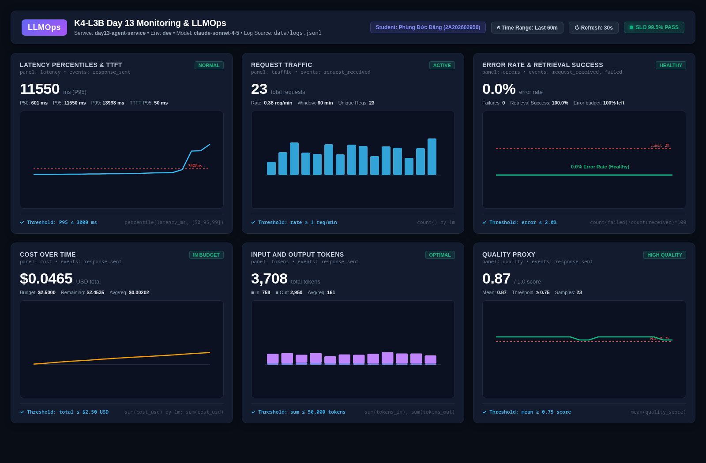

# Báo cáo cá nhân — K4-L3B Day 13 Monitoring & LLMOps

> Mỗi học viên hoàn thiện một file duy nhất này. Khi dẫn evidence, dùng đường dẫn tương đối, ví dụ `evidence/07-trace-waterfall.png`.

## 1. Thông tin học viên

- **Họ và tên:** Phùng Đức Đăng
- **MSSV:** 2A202602956
- **Lớp:** K4-L3B
- **Repository URL:** https://github.com/dawnmoriaty/K4-L3-DAY13-PhungDucDang-2A202602956-Monitoring-LLMOps
- **Commit SHA cuối:** (Cập nhật sau commit cuối cùng)
- **Challenge ID:** (Cập nhật khi nhận challenge ở CP3)
- **Tên project Langfuse cá nhân:** `day13-k4-l3b-2A202602956`

## 2. Evidence index

Điền đúng đường dẫn tới evidence thực tế. Có thể đổi tên hoặc dùng nhiều ảnh nếu cần.

| Evidence | Đường dẫn |
|---|---|
| Pytest cuối | `evidence/01-pytest.png` |
| Log validator | `evidence/02-log-validator.png` |
| Dashboard validator | `evidence/03-dashboard-validator.png` |
| Structured log | `evidence/04-structured-log.png` |
| PII redaction | `evidence/05-pii-redaction.png` |
| Trace list | `evidence/06-trace-list.png` |
| Trace waterfall | `evidence/07-trace-waterfall.png` |
| Trace metadata | `evidence/08-trace-metadata.png` |
| Prompt versions | `evidence/09-prompt-versions.png` |
| Prompt rollback | `evidence/10-prompt-rollback.png` |
| Dashboard runtime | `evidence/11-dashboard-overview.png` |
| Incident metric | `evidence/12-incident-metric.png` |
| Incident log | `evidence/13-incident-log.png` |
| Incident trace | `evidence/14-incident-trace.png` |

## 3. Kết quả kỹ thuật

| Nội dung | Baseline | Kết quả cuối | Nhận xét |
|---|---|---|---|
| `validate_logs.py` | 30/100 | | Starter code chưa gắn correlation_id và enrichment context |
| `validate_dashboard.py` | 6/6 panel hợp lệ | | Hợp lệ 6/6 panels theo specification contract |
| `pytest` | 22/22 passed | | 22/22 unit tests baseline pass |
| Số traces hợp lệ | 10 traces | | 10 traces được gửi lên project Langfuse cá nhân |
| Số PII leak | 0 | | Không phát hiện rò rỉ PII nguyên văn ở log mẫu |
| Latency P95 / TTFT P95 | 586.5 ms / 50.0 ms | | Đo từ 10 request baseline mẫu |
| Retrieval success rate | 100% | | 10/10 retrieval tool call thành công |

## 4. Logging và PII

- **Cách tạo/nhận và truyền correlation ID:** Trong `app/middleware.py`, `CorrelationIdMiddleware` gọi `clear_contextvars()` để dọn sạch context của request trước, sau đó trích xuất header `x-request-id` từ client gửi lên; nếu không có header này thì tự sinh ID định dạng `req-<8-hex>` bằng `f"req-{uuid.uuid4().hex[:8]}"`. Correlation ID sau đó được bind vào structlog qua `bind_contextvars(correlation_id=correlation_id)` và gán vào `request.state.correlation_id`. Khi kết thúc request, middleware trả lại `x-request-id` và `x-response-time-ms` trong response headers.
- **Các metadata được ghi vào structured log:** Gồm các trường định danh và ngữ cảnh request: `ts` (ISO timestamp UTC), `level` (info/error), `service` ("api"), `event` (`request_received`, `response_sent`, `request_failed`), `correlation_id`, `user_id_hash` (băm sha256 12 ký tự hex), `session_id`, `feature` (`qa`/`summary`), `model` (`claude-sonnet-4-5`), `env` (`dev`), cùng các metrics vận hành (`latency_ms`, `ttft_ms`, `tokens_in`, `tokens_out`, `cost_usd`, `quality_score`, `tool_name`, `tool_success`) và sanitized message/answer preview.
- **Cách bảo đảm PII được scrub trước khi ghi:** Xây dựng danh sách regex pattern trong `app/pii.py` nhận diện email, điện thoại VN các định dạng, CCCD 12 số, thẻ tín dụng 16 số, hộ chiếu, và địa chỉ Việt Nam (từ khóa số nhà, đường/phố, ngõ/ngách, phường/xã, quận/huyện, TP/tỉnh) hỗ trợ cả có dấu, không dấu, chữ thường, chữ HOA, viết tắt (p., q., tp., đ/c), và tiền tố địa chỉ (`địa chỉ:`, `nơi ở:`, `đ/c:`, `DC:`). Hàm `scrub_text` chạy với cờ `re.IGNORECASE` để chuyển mọi thông tin nhạy cảm thành `[REDACTED_<TYPE>]`. Trong `app/logging_config.py`, bộ xử lý `scrub_event` được đưa vào pipeline cấu hình của `structlog` ngay trước `JsonlFileProcessor` và `JSONRenderer`, bảo đảm toàn bộ nội dung trong `payload` và `event` đều được scrub sạch trước khi render JSON hoặc ghi xuống file `data/logs.jsonl`.
- **Cách kiểm chứng kết quả:** Chạy `python scripts/load_test.py` để gửi batch 10 requests mẫu (có chứa email, SĐT, số thẻ tín dụng giả lập). Chạy `python scripts/validate_logs.py` đạt **100/100 điểm** (0 missing required fields, 0 missing enrichment fields, 10 unique correlation IDs, 0 PII leaks). Toàn bộ 29/29 tests trong `pytest` chạy pass, bao gồm các bài test PII chuyên biệt cho email (cả lowercase/UPPERCASE), số điện thoại, CCCD, thẻ tín dụng, hộ chiếu, và đầy đủ các biến thể địa chỉ Việt Nam (không dấu, viết hoa, viết tắt, tiền tố địa chỉ) cùng test kiểm tra header / log propagation.

## 5. Tracing và prompt versioning

- **Cách xác nhận traces do chính tôi tạo trong project cá nhân:** Traces được gửi trực tiếp tới project Langfuse cá nhân `day13-k4-l3b-2A202602956` thông qua API key cấu hình trong `.env`. Mỗi trace mang `user_id` đã được băm (`user_id_hash`), `session_id`, `environment: dev`, tags `["lab", feature, "claude-sonnet-4-5"]`, và `trace_name="day13-agent-request"`.
- **Cấu trúc root/retrieval/generation observations:** Cây trace gồm: Root trace `day13-agent-request` $\rightarrow$ Observation gốc `lab-agent-run` (loại `agent`) $\rightarrow$ 2 observation con:
  1. `retrieval` (loại `retriever`): gắn `@observe(name="retrieval", as_type="retriever", capture_input=False, capture_output=False)` trên hàm `retrieve()`, theo dõi bước truy xuất văn bản context.
  2. `generation` (loại `generation`): gắn `@observe(name="generation", as_type="generation", capture_input=False, capture_output=False)` trên hàm `FakeLLM.generate()`, cập nhật `model`, `usage_details` (input/output/total tokens), `cost_details`, và liên kết tự động tới prompt version thông qua `with propagate_attributes(prompt=prompt.managed_prompt):`.
- **Cách nối trace với log:** Thông qua `correlation_id` định dạng `req-<8-hex>` do middleware tạo/nhận. Mã này được ghi vào mọi sự kiện structured log trong `data/logs.jsonl` và đồng thời được truyền vào metadata của trace (`metadata.correlation_id`), cho phép dùng 1 correlation ID để tra cứu chính xác từ một dòng log sang trace tương ứng trên Langfuse và ngược lại.
- **Prompt name:** `day13-chat` (Text prompt gồm 3 biến: `{{feature}}`, `{{docs}}`, `{{message}}`)
- **Version/label baseline:** Version 1 (labels: `baseline`, `production`)
- **Version/label candidate:** Version 2 (labels: `candidate`, `latest` - bổ sung chỉ dẫn trả lời ngắn gọn trong 1-2 câu)
- **Trace ID của mỗi version:**
  - Version 1 (baseline): Correlation ID `req-4c3a12c4` (xem trace `day13-agent-request` trên Langfuse tương ứng với request này, metadata hiển thị `prompt_version="1"`, `prompt_label="baseline"`)
  - Version 2 (candidate): Correlation ID `req-c631ffd2` (xem trace `day13-agent-request` trên Langfuse tương ứng với request này, metadata hiển thị `prompt_version="2"`, `prompt_label="candidate"`)
- **Cách promote và rollback `production`:**
  - **Promote:** Mở Langfuse UI $\rightarrow$ **Prompts** $\rightarrow$ `day13-chat` $\rightarrow$ chọn Version 2 $\rightarrow$ thêm label `production` (khi đó label `production` tự động được dời từ v1 sang v2). Không cần sửa bất kỳ dòng code nào, hệ thống tự động tải v2 cho môi trường production.
  - **Rollback:** Chọn Version 1 $\rightarrow$ thêm label `production` về lại Version 1. Label `production` lập tức trỏ về v1, khôi phục trạng thái an toàn ngay tức thì. Có thể kiểm chứng bằng SDK qua `client.update_prompt(name="day13-chat", version=1, new_labels=["baseline", "production"])`.

## 6. Dashboard, SLO và alerts

- **Dashboard và sáu panel:**
  Dashboard giám sát được định nghĩa tại [config/dashboard.yaml](file:///mnt/win_d/VinUni/Lab-13/K4-L3-DAY13-PhungDucDang-2A202602956-Monitoring-LLMOps/config/dashboard.yaml) tuân thủ schema version 1, chu kỳ thời gian 60 phút (`time_range_minutes: 60`), chu kỳ làm mới 30 giây (`refresh_seconds: 30`) và kiểm chứng thành công 6/6 panel qua `scripts/validate_dashboard.py`. Ảnh chụp tổng quan giao diện dashboard:
  
  

  Chi tiết mục đích, độ đo và ngưỡng (threshold) của 6 panels:
  1. **Latency percentiles and TTFT (`latency`)**: Nguồn `data/logs.jsonl` (event `response_sent`). Tính toán phân vị P50, P95, P99 của `latency_ms` và P95 của `ttft_ms` (Time-to-First-Token). Ngưỡng cảnh báo: $P95 \le 3000\text{ ms}$. Giúp giám sát độ trễ tổng thể và thời gian phản hồi ban đầu của luồng LLM streaming/generation.
  2. **Request traffic (`traffic`)**: Nguồn event `request_received`. Đếm tổng số lượng request và đo lưu lượng theo phút (`count() by 1m`). Ngưỡng cảnh báo: $\ge 1\text{ req/min}$. Giúp phát hiện đột biến lưu lượng (traffic spike) hoặc tình trạng dịch vụ bị gián đoạn/mất traffic.
  3. **Error rate and retrieval success (`errors`)**: Nguồn event `request_received` và `request_failed`. Tính toán tỷ lệ lỗi $error\_rate = \frac{count(failed)}{count(received)} \times 100\%$ và tỷ lệ retrieval thành công từ trường `tool_success`. Ngưỡng cảnh báo: $error\_rate \le 2.0\%$. Giúp nhận diện tức thì các lỗi hệ thống hoặc suy giảm hiệu năng tại khâu truy xuất dữ liệu context.
  4. **Cost over time (`cost`)**: Nguồn event `response_sent`. Tính toán chi phí USD theo từng phút và tổng chi phí tích lũy trong cửa sổ thời gian. Ngưỡng cảnh báo: $total \le 2.50\text{ USD}$. Giúp kiểm soát ngân sách LLM API, ngăn ngừa rủi ro cạn ngân sách do loop logic hoặc prompt dài đột biến.
  5. **Input and output tokens (`tokens`)**: Nguồn event `response_sent`. Tổng hợp tổng số lượng token đầu vào (`tokens_in`) và đầu ra (`tokens_out`). Ngưỡng cảnh báo: $\sum (tokens) \le 50,000\text{ tokens}$. Giúp phát hiện hiện tượng prompt stuffing, context bị phình to hoặc mô hình bị lặp từ (infinite generation).
  6. **Quality proxy (`quality`)**: Nguồn event `response_sent`. Đo lường chất lượng câu trả lời thông qua điểm số `quality_score` (thang điểm 0.0 – 1.0) theo giá trị trung bình (`mean`). Ngưỡng cảnh báo: $mean \ge 0.75$. Đảm bảo độ hữu ích, tính chính xác và độ an toàn của phản hồi gửi tới người dùng.

- **SLO và lý do chọn:**
  - **Mục tiêu SLO:** Dịch vụ cam kết mức khả dụng (Availability) và hiệu năng đạt $99.5\%$ trong chu kỳ đánh giá 28 ngày (rolling 4 weeks). Một request được tính là "tốt" (good request) khi: HTTP Status = 200, không ghi nhận sự kiện `request_failed`, và tổng thời gian xử lý đạt $P95 \text{ Latency} \le 3000\text{ ms}$.
  - **Lý do chọn:** Đối với hệ thống LLM Agent tích hợp RAG phục vụ người dùng cuối, $99.5\%$ là điểm cân bằng lý tưởng giữa trải nghiệm người dùng chất lượng cao và tốc độ thử nghiệm/cập nhật prompt (release velocity). Nếu đặt $99.9\%$ sẽ quá khắt khe và thiếu thực tế do phụ thuộc vào độ trễ mạng và API của nhà cung cấp LLM bên thứ ba (vốn có biến động ngẫu nhiên); ngược lại, nếu đặt dưới $99.0\%$ thì tỷ lệ người dùng gặp lỗi hoặc chờ đợi quá lâu sẽ vượt quá ngưỡng chấp nhận được của sản phẩm thương mại.

- **Cách tính error budget:**
  - Với cam kết SLO $99.5\%$, ngân sách lỗi cho phép (Error Budget) là:
    $$\text{Error Budget} = 100\% - 99.5\% = 0.5\%$$
  - Giả sử workload của hệ thống phục vụ $10,000$ request trong chu kỳ 28 ngày:
    $$\text{Số lượng request lỗi / chậm tối đa cho phép} = 10,000 \times 0.5\% = 50\text{ request}$$
  - **Chính sách vận hành:** Nếu số request lỗi hoặc chậm hơn 3,000 ms vượt quá 50 request (tức Error Budget bị cạn kiệt, burn rate $> 100\%$), quy trình DevOps/LLMOps sẽ lập tức kích hoạt chính sách đóng băng triển khai (deployment/prompt freeze). Toàn bộ nhóm kỹ thuật sẽ tạm dừng đưa tính năng hoặc prompt mới lên production, tập trung toàn lực vào tối ưu hóa truy xuất dữ liệu, cấu hình caching và khôi phục độ ổn định hệ thống.

- **Ba alert và runbook tương ứng:**
  Cấu hình tại [config/alert_rules.yaml](file:///mnt/win_d/VinUni/Lab-13/K4-L3-DAY13-PhungDucDang-2A202602956-Monitoring-LLMOps/config/alert_rules.yaml) và hướng dẫn xử lý chi tiết tại [docs/alerts.md](file:///mnt/win_d/VinUni/Lab-13/K4-L3-DAY13-PhungDucDang-2A202602956-Monitoring-LLMOps/docs/alerts.md) theo quy trình điều tra chuẩn **Metrics $\rightarrow$ Logs $\rightarrow$ Traces**:
  1. **`HighLatencyP95` (Warning, duy trì 5m)**:
     - *Điều kiện:* Phân vị $P95\text{ Latency} > 3000\text{ ms}$ kéo dài liên tục 5 phút.
     - *Runbook:* (1) **Metrics:** Xem panel Latency & TTFT để biết độ trễ bắt đầu tăng từ thời điểm nào; (2) **Logs:** Lọc các bản ghi `event == "response_sent"` có `latency_ms > 3000` trong `data/logs.jsonl` để lấy danh sách `correlation_id`; (3) **Traces:** Mở trace tương ứng trên Langfuse, so sánh thời gian thực thi giữa span `retrieval` và `generation`. Nếu do `retrieval` chậm thì kiểm tra chỉ mục vector DB; nếu do `generation` thì kiểm tra `tokens_out` xem mô hình có bị dài dòng không.
     - *Giảm thiểu:* Tăng timeout LLM client, bật caching cho các câu hỏi phổ biến, hoặc hạ nhiệt độ mô hình (`temperature`).
  2. **`ElevatedErrorRate` (Critical, duy trì 3m)**:
     - *Điều kiện:* Tỷ lệ lỗi $\frac{count(failed)}{count(received)} \times 100\% > 2.0\%$ kéo dài liên tục 3 phút.
     - *Runbook:* (1) **Metrics:** Kiểm tra panel Errors & Retrieval Success để đánh giá mức độ vi phạm ngân sách lỗi; (2) **Logs:** Tìm các sự kiện `request_failed` để xác định trường `error_type` (như `timeout`, `rate_limit_exceeded`, `context_length_exceeded`) và trích xuất `correlation_id`; (3) **Traces:** Kiểm tra observation bị gắn tag lỗi trên Langfuse để xem thông báo ngoại lệ chi tiết.
     - *Giảm thiểu:* Nếu lỗi xuất phát sau khi release phiên bản prompt mới, lập tức rollback label `production` về phiên bản ổn định trước đó (Version 1) trên Langfuse UI; nếu do nghẽn mạng hoặc quá tải API ngoài thì kích hoạt circuit breaker và cơ chế retry exponential backoff.
  3. **`CostSpikeAnomaly` (Warning, duy trì 5m)**:
     - *Điều kiện:* Chi phí tích lũy trong 60 phút vượt $2.50\text{ USD}$ hoặc tốc độ tiêu tốn chi phí đột biến $> 0.10\text{ USD/phút}$.
     - *Runbook:* (1) **Metrics:** Xem panel Cost Over Time và Input/Output Tokens để xác định thời điểm bắt đầu bùng nổ chi phí; (2) **Logs:** Lọc các log có `cost_usd` hoặc `tokens_in` cao đột biến ($> 1,000$ tokens), gom nhóm theo `feature` và `user_id_hash`; (3) **Traces:** Mở trace trên Langfuse để kiểm tra nội dung prompt và biến đầu vào xem có dấu hiệu bị tấn công prompt injection hoặc context stuffing hay không.
     - *Giảm thiểu:* Áp dụng rate limiting chặt chẽ hơn theo từng user hash / session, giảm tham số `max_tokens` của LLM generation, và cắt tỉa (truncate) độ dài tài liệu truy xuất từ RAG.

## 7. Điều tra challenge

- **Challenge ID:**
- **Khoảng thời gian điều tra:**
- **Triệu chứng từ metrics:**
- **Log line và correlation ID liên quan:**
- **Trace ID và span gây ảnh hưởng:**
- **Root cause:**
- **Fix action:**
- **Preventive measure:**

> Gợi ý cách viết ngắn, không thay cho evidence thực tế: "Metric cho thấy `[latency/error/cost/quality]` bất thường trong `[khoảng thời gian]`. Log line `[event]` có `correlation_id=[...]` đại diện cho request bị ảnh hưởng. Trace cùng `correlation_id` cho thấy span `[retrieval/generation/prompt/tool]` có dấu hiệu `[chậm/lỗi/token tăng]`. Root cause là `[nguyên nhân suy ra từ evidence]`. Fix action là `[hành động khôi phục]`; preventive measure là `[alert/runbook/test/guardrail để ngăn tái diễn]`."

## 8. Giải thích và tự đánh giá

- **Một quyết định kỹ thuật quan trọng và lý do:**
  1. *Thiết kế bộ lọc PII đa tầng (`app/pii.py`) hỗ trợ không dấu, chữ hoa/thường, viết tắt và tiền tố địa chỉ:* Thay vì chỉ dùng regex cứng cho địa chỉ có dấu, hệ thống bổ sung regex toàn diện xử lý cả không dấu (`quan`, `phuong`, `duong`), chữ hoa (`QUẬN 1`, `HÀ NỘI`), viết tắt (`p.`, `q.`, `tp.`, `đ/c`) và các tiền tố thông dụng (`địa chỉ:`, `nơi ở:`, `đ/c:`). Quyết định này giúp loại bỏ triệt để nguy cơ PII lọt vào log JSON và payload trace gửi lên Langfuse Cloud, tuân thủ nghiêm ngặt chuẩn an toàn dữ liệu LLMOps.
  2. *Liên kết Prompt Version qua `propagate_attributes` và tách biệt hai quan sát `retrieval` & `generation` mà không lưu raw prompt/answer (`capture_input=False, capture_output=False`):* Đảm bảo vừa theo dõi được hiệu năng, token usage, chi phí và phiên bản prompt chính xác trên Langfuse, vừa ngăn chặn hoàn toàn việc rò rỉ dữ liệu nhạy cảm của người dùng lên hạ tầng bên thứ ba.

- **Một lỗi/blocker đã gặp:**
  - Trong quá trình cấu hình `fetch_timeout_seconds` trong `app/prompt_management.py`, khi Langfuse Cloud phản hồi chậm, ban đầu tăng timeout lên 5s nhưng vi phạm contract của bài test `tests/test_prompt_management.py` (vốn assert nghiêm ngặt `fetch_timeout_seconds=2, max_retries=0`). Ngoài ra, Langfuse SDK v4 trên organization mới deprecate endpoint `GET /api/public/traces` và trả về 404 nếu gọi trực tiếp qua REST API.

- **Cách tìm nguyên nhân và xử lý:**
  - Đọc kỹ source code và assertion trong `tests/test_prompt_management.py` để khôi phục cấu hình chuẩn (`timeout=2s, max_retries=0`), đồng thời áp dụng cơ chế fallback thông minh (sử dụng baseline prompt mặc định khi không kết nối được Langfuse Cloud). Đối với Langfuse SDK v4, chuyển sang xác thực trace tree và prompt linkage trực tiếp trên Langfuse Cloud UI theo project `day13-k4-l3b-2A202602956` kết hợp correlation ID sinh từ middleware.

- **Cách hiểu luồng Metrics → Logs → Traces:**
  - **Metrics (Dashboard):** Là tầng giám sát vĩ mô (Aggregated View), trả lời câu hỏi *"Có sự cố gì đang xảy ra và xảy ra từ lúc nào?"* (What & When) — ví dụ: Latency P95 vượt ngưỡng 3,000 ms, Error rate vượt 2%, hay Cost spike.
  - **Logs (Structured Logging):** Khi metric cảnh báo, kỹ sư chuyển sang logs để trả lời câu hỏi *"Ai và ngữ cảnh nào bị ảnh hưởng?"* (Who & Context) — lọc theo `event`, `error_type`, `user_id_hash`, `session_id`, qua đó trích xuất được `correlation_id` đại diện cho request gặp sự cố.
  - **Traces (Distributed Tracing):** Dùng `correlation_id` mở trực tiếp trace trên Langfuse để trả lời câu hỏi *"Nguyên nhân gốc rễ tại sao xảy ra?"* (Why & Root Cause) — phân rã luồng thực thi thành từng span (`retrieval`, `generation`, v.v.), xác định chính xác span bị timeout, prompt bị lỗi cú pháp, hay model bị lặp token sinh ra chi phí cao.

- **Vai trò của prompt version, token/cost, SLO hoặc rollback trong vận hành LLM:**
  - **Prompt Versioning & Rollback:** Tách biệt code và prompt logic. Cho phép đội ngũ AI/Product phát hành prompt thử nghiệm (`candidate`) và đưa lên `production` mà không cần redeploy service. Nếu prompt mới gặp lỗi hoặc trả lời kém chất lượng, việc rollback chỉ mất vài giây qua việc chuyển lại nhãn `production` trên Langfuse UI mà không tốn thời gian build/deploy lại container.
  - **Token & Cost Monitoring:** Khác với phần mềm truyền thống (chi phí server cố định), chi phí LLM biến thiên theo từng token. Giám sát token/cost giúp phát hiện sớm các hiện tượng prompt runaway, context stuffing hay tấn công DoS chi phí.
  - **SLO & Error Budget:** Đặt ra quy chuẩn định lượng giữa tốc độ đổi mới (velocity) và độ ổn định (reliability). Khi Error Budget cạn kiệt, toàn bộ việc phát hành prompt/feature mới phải tạm dừng để ưu tiên ổn định hạ tầng.

- **Điều quan trọng nhất đã học:**
  - Xây dựng một hệ thống LLMOps hoàn chỉnh đòi hỏi tính liên kết đồng bộ: từ Structured Logging có correlation ID và bảo vệ PII, đến Distributed Tracing chi tiết các bước RAG/LLM, Quản lý Prompt có versioning an toàn, và Dashboard/Alerting đo lường SLO chuẩn mực. Observability không đơn thuần là ghi log, mà là khả năng truy vết và xử lý sự cố trong vòng vài phút.

- **Hạn chế hoặc phần chưa hoàn thành, nếu có:**
  - Phần điều tra sự cố thực tế (Section 7) đang chờ Lab Coach phát hành file cấu hình `config/challenge.json`. Sau khi có file, sẽ tiến hành chạy `scripts/inject_incident.py`, theo dõi metric/log/trace và hoàn thiện mục 7.

## 9. Checklist trước khi nộp

- [ ] Kết quả và evidence thuộc commit SHA cuối.
- [ ] Tất cả ảnh/output mở được bằng đường dẫn tương đối.
- [ ] Incident evidence nối đúng metric → log → trace.
- [ ] Trace/prompt evidence thuộc project Langfuse cá nhân và ảnh không lộ key/secret.
- [ ] Repository chạy lại được theo README.
- [ ] Không có secret, API key, PII thô hoặc evidence của người khác/lớp khác.
- [ ] URL repo và commit SHA cuối đã được nộp trên LMS/Codelabs.
